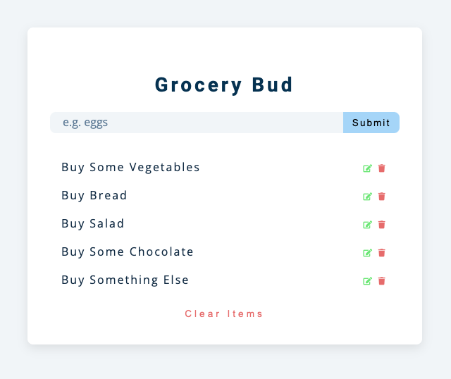

# Grocery bud

> A simple website to add, edit and delete items.

## Table of contents

- [General info](#general-info)
- [Screenshots](#screenshots)
- [Technologies](#technologies)
- [Setup](#setup)
- [Features](#features)
- [Status](#status)
- [Inspiration](#inspiration)
- [Contact](#contact)

## General info

> The objective of the project is to practice separation of concern in
> JavaScript.

## Screenshots



## Technologies

- JavaScript
- HTML5
- CSS3
- VSC code

## Setup

`npm install`

## Code Examples

```js
import addTodoHandler from '../handlers/addTodoHandler.js';
import dom from '../dom.js';

const addTodoListener = () => {
	dom.submitBtn.addEventListener('click', (e) => {
		e.preventDefault();
		addTodoHandler(dom.input.value);
	});
};

export default addTodoListener;
```

## Features

List of features ready and Todos for future development

-
-
-

To-do list:

-
-

## Status

Project is: _in progress_
